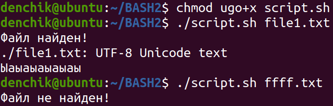

# BASH script (find, file)
## Код
<pre>
<code>
#!/bin/bash

filename=$1
searching=$(find . -name $filename)
if [[ -n $searching ]]
then
	echo "Файл найден!"
	file $searching
	cat $searching
else
	echo "Файл не найден!"
fi
</code>
</pre>
## Результат
</img>
